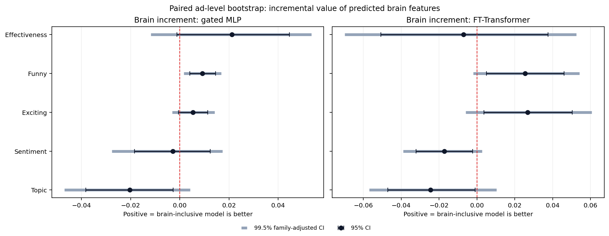
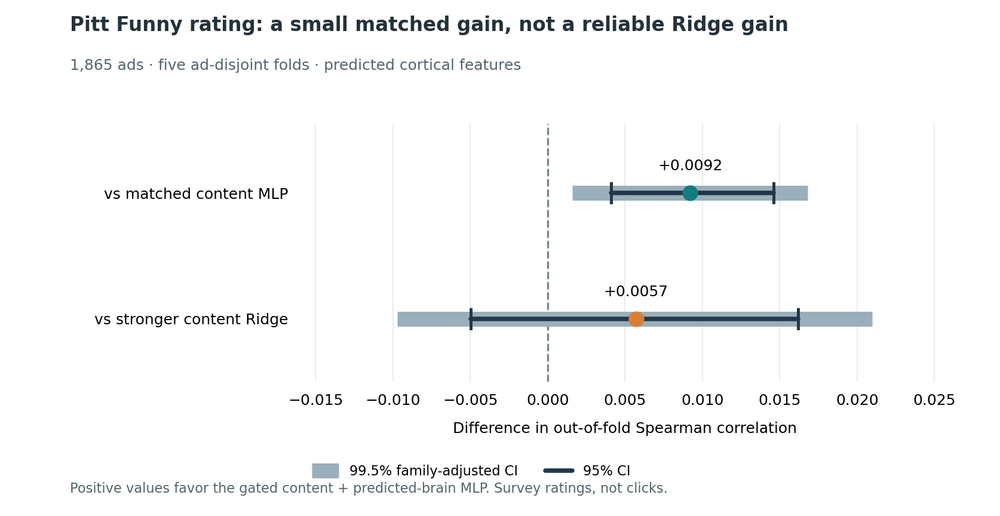

# Pitt advertisement ratings: a matched content and predicted-brain comparison

**Research status:** completed, exploratory benchmark on 1,865 advertisements. This case study reports the result that survived its matched-model analysis and the stronger baseline check. It does not report clicks, conversion, measured responses from Pitt raters, or a deployed product.

## Question

Can a representation of *TRIBE-predicted* cortical activity add information when estimating human annotations of an advertisement, beyond features extracted directly from its video, audio, and language? The main comparison holds the advertisements, outer folds, target, and model family fixed while adding the predicted-brain features.

## Data and evaluation

The cohort contains **1,865 ads** from the [Pitt video-advertisement dataset](https://people.cs.pitt.edu/~kovashka/ads/), which lists 3,477 videos overall. Its Funny and Exciting targets are fractions of annotators voting yes; its Effective target is a subjective 1–5 rating. These are annotation outcomes, not observed advertising performance. See the [source annotation guide](https://people.cs.pitt.edu/~kovashka/ads/readme_videos.txt).

- Five frozen, advertisement-disjoint outer folds; **373 held-out ads per fold**.
- All compared models used the same held-out ads. Dimensionality reduction was fit on each training fold only: 128 content and 64 predicted-brain components in the deep-tabular benchmark.
- Models included content-only Ridge and MLP baselines, a gated content-plus-brain MLP, and reduced FT-Transformer variants. The deep models used two deterministic seeds per fold, inner validation for early stopping, and an outer-training refit.
- Primary regression summary: out-of-fold Spearman rank correlation. Increment estimates used **5,000 paired ad-level bootstrap resamples**; the 99.5% intervals adjust a family of ten planned target-by-model comparisons.

## What the results show

| Pitt annotation | Content Ridge | Content MLP | Content + predicted-brain gated MLP | Reading |
| --- | ---: | ---: | ---: | --- |
| Funny | 0.7078 | 0.7043 | **0.7135** | Small gain over the matched MLP; no reliable gain over Ridge |
| Exciting | **0.5622** | 0.5545 | 0.5599 | No reliable predicted-brain increment |
| Effectiveness (1–5 rating) | **0.1601** | 0.1030 | 0.1242 | No reliable predicted-brain increment |
| Sentiment | 0.1196 | **0.1314** | 0.1286 | No improvement from added brain features |
| Topic | **0.4152** | 0.3422 | 0.3219 | Added brain features were worse in this model |

The first three rows report Spearman correlation; Sentiment and Topic report macro-F1. Values are out-of-fold scores, not training accuracy.

The **Funny** comparison increased Spearman by **0.0092** relative to the matched content MLP (0.7043 → 0.7135; family-adjusted 99.5% CI for the increment **0.0016–0.0168**). The combined model was only **0.0057** above the content-only Ridge benchmark; that difference was not reliable (95% CI **−0.0050–0.0162**). The broader claim that predicted-brain features improve the strongest available content model is therefore **not established**. No reliable increment was established for Effectiveness, Exciting, Sentiment, or Topic.



The stronger baseline changes the interpretation:



This figure is regenerated from the aggregate tables by `python pitt/figures/render_funny_comparison.py` from the repository root.

The underlying aggregate tables are available as [out-of-fold scores](aggregate_results/primary_metrics.csv), [matched brain increments](aggregate_results/primary_brain_comparisons.csv), and [Ridge comparisons](aggregate_results/primary_ridge_comparisons.csv). They contain summary statistics only, with no advertisement-level records.

## What I built

The public code here contains the original experiment's [content baseline](scripts/evaluate_effectiveness.py), [matched brain comparison](scripts/evaluate_models_bc.py), [deep tabular evaluator](scripts/evaluate_deep_tabular.py), [fold-result merger and uncertainty analysis](scripts/merge_deep_tabular.py), and [comparison against Ridge](scripts/compare_deep_to_ridge.py). It also includes [surface parcellation](scripts/parcellate_hcp_mmp1.py), [derived brain-feature construction](scripts/build_brain_features.py), and [synthetic split and bootstrap tests](tests/test_models_bc.py). The scripts take paths through command-line arguments; no source media, predictions, annotations, checkpoint, or atlas asset is distributed here.

The design deliberately preserves the distinction between the full predicted cortical time series and derived regional summaries. Map-similarity scores are mathematical similarities to reference maps, not measurements of a person's thoughts or reactions.

To run the included synthetic tests with Python and NumPy installed:

```bash
python -m unittest discover -s pitt/tests -p 'test_*.py'
```

Reproducing the reported benchmark requires separately obtained inputs and the original frozen split and model versions. Passing the public synthetic tests verifies selected split and bootstrap behavior; it cannot reproduce the reported score without those inputs.

## Limits and next test

The predicted cortical features were generated by a pretrained model from the advertisements. They are **not fMRI measurements from the people who rated the Pitt ads**. The scores estimate subjective annotations, not click-through, sales, persuasion, or causal effects. Frozen ad-disjoint folds reduce obvious advertisement leakage, but independent campaigns, temporal shifts, and external datasets remain untested.

A stronger follow-up would freeze the content-only Ridge baseline before fitting a content-plus-brain challenger, audit near-duplicate and campaign groups, and assess the full selection pipeline on an independent or prospective holdout. A complete permutation and repeated-group evaluation would test whether the narrow Funny result persists.

## Provenance and data use

The numbers and plots above were transcribed from the locally checksum-verified **30 August 2026 v2 deep-tabular report** and its aggregate tables. Earlier exploratory model comparisons are not substituted for this baseline check. The Pitt dataset authors ask users to cite their [2017 dataset paper](https://people.cs.pitt.edu/~kovashka/ads/); [TRIBE v2](https://github.com/facebookresearch/tribev2) is credited as the source of the pretrained prediction method. Advertisements, media URLs/IDs, individual annotations, per-ad predictions, model weights, and participant data are excluded from this portfolio.
