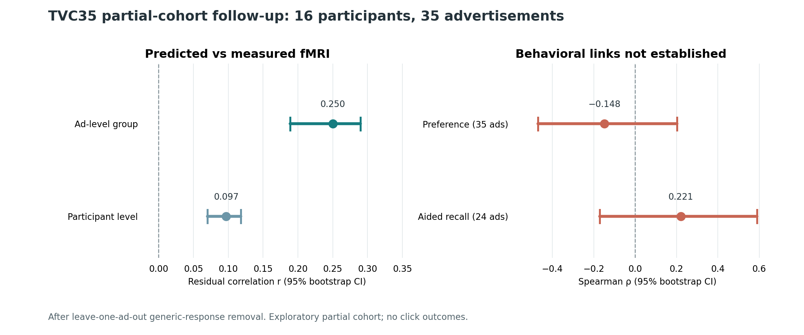

# Study 1 — comparing predicted responses with measured fMRI

## Question

Can TRIBE's model-predicted cortical time courses track measured human fMRI responses to the same advertisements, beyond a generic response common to many ads?

## Design and verified result

The available partial TVC35 Study 1b set includes **16 of 20 participants** and **35 of 35 advertisements**. The follow-up used a previously frozen reliable-parcel mask and hemodynamic lag. For every target ad, it built generic time courses from the other 34 ads separately for prediction and measured fMRI, subtracted those leave-one-ad-out templates, and compared the remaining time-varying patterns.

Group-level advertisement-specific correlation was **r = 0.250**, with an advertisement-bootstrap 95% interval of **0.189–0.290**. A participant-level estimate was smaller: **r = 0.097**, with a two-way participant-by-ad bootstrap interval of **0.070–0.118**. Temporal shifts, wrong-ad pairing, spatial-spin nulls, reversal, and segment-edge trimming were tested as controls. The result supports correspondence to measured audiovisual responses in this partial cohort; it does not identify a viewer's thoughts or validate commercial ad impact.

The figure uses only the aggregate reported estimates and intervals. Recreate it with `python figures/render_study1_summary.py` from this directory after installing the public demo requirements.

## Negative behavioral result

The association between the ad-level neural correspondence and preference was **Spearman ρ = −0.148** across 35 ads; the aided-recall association was **ρ = 0.221** across 24 ads. Both Holm-corrected p values were **0.609**, and both bootstrap intervals crossed zero. The available sample therefore does **not** establish a preference or recall link. It contains no click outcome.

## Limits and next gate

Four Study 1b participants and most Study 1a scans are unavailable. The ads' original videos and matched content representations are not available here for a content-versus-brain comparison. A separate-site or independent-stimulus replication is needed before broad physiological generalization. This repository deliberately omits participant-level arrays, ad-level data and owner-supplied predictions.
