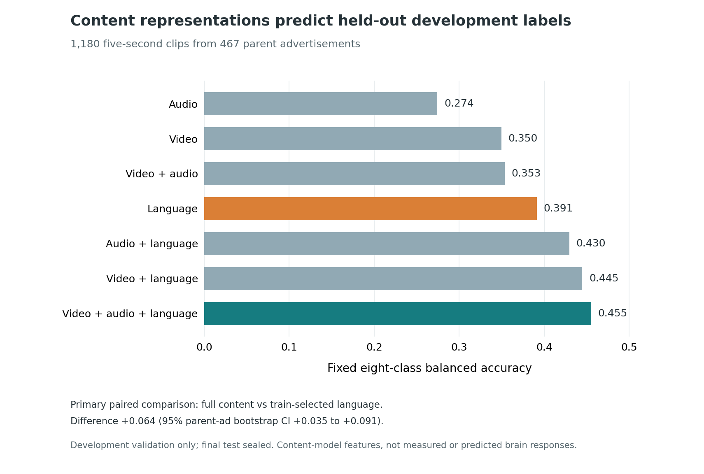

# Study 2 — multimodal representations of short advertisements

**Research snapshot: 4 October 2026.** This study asks whether visual, acoustic, and spoken-language representations predict the released eight-category emotion-change label for five-second [AdCumen](https://doi.org/10.1038/s41598-024-76968-9) advertisement clips from unseen parent advertisements. It uses the content encoders within [TRIBE v2](https://github.com/facebookresearch/tribev2); **content features are not brain responses**.

## What is complete

| Gate | Independently checked result |
| --- | --- |
| Cohort | 10,000 transcript-screened development clips selected without emotion labels; 8,820 training and 1,180 development-validation clips. |
| Extraction | 10,000 video, audio, and language feature files, each with a checksum receipt; exact membership, provenance, shapes, and half-open 2 Hz timing reconciled. |
| Modeling | Seven content views evaluated with training-only, parent-ad-grouped model selection. |
| Development validation | 1,180 clips from 467 parent ads scored once; final-test labels remain sealed. |

The combined **video + audio + language** view achieved **0.455 fixed-eight-class balanced accuracy**. The strongest single modality, language, was chosen by training-only cross-validation and scored **0.391** on the *same* validation clips. The paired difference is **+0.064** (95% parent-ad bootstrap interval **+0.035 to +0.091**). Balanced accuracy is the mean of the eight class recalls; these numbers are development-validation estimates, not click, conversion, or final-test results. Calibration remains imperfect.



Read the [case study](STUDY2_CASE_STUDY.md) for the method, failures, validation checks, full score table, and limitations. The [roadmap](ROADMAP.md) marks completed work and conditional next steps. Its neural-feature branch has **no Study 2 predictive result yet**.

## Reproducible synthetic example

This section includes original, small-scale code demonstrating label-blind selection, parent-split checks, 2 Hz feature-file checks, and exact file-and-receipt reconciliation. It uses generated toy records, **not** the restricted AdCumen corpus or production model weights.

From the repository root:

```bash
python3 -m pip install -r study2/requirements.txt
python3 study2/examples/synthetic_demo.py
python3 -m unittest discover -s study2/tests -v
python3 study2/figures/render_validation_figure.py
```

The chart uses audited aggregate scores hard-coded in its renderer. The synthetic example illustrates the integrity gates; it does not reproduce the reported accuracy without separately licensed data and models.

## Data and interpretation boundaries

The cohort was screened through automatic transcripts and text plausibility, **not** human audio verification. Parent-ad separation and a strong-visual-similarity quarantine reduce known leakage, but do not prove every cross-split near-duplicate has been found. The five-second labels do not establish precise emotional trigger times, actual viewer brain activity, click-through rate, conversion, or causal effectiveness.

Only reviewed original code, aggregate results, and synthetic fixtures are included. Advertisement media, transcripts, clip and parent identifiers, per-clip labels or predictions, feature arrays, pretrained weights, and cluster logs are excluded. The upstream [AdCumen research data](https://doi.org/10.1038/s41598-024-76968-9) and [TRIBE v2](https://github.com/facebookresearch/tribev2) have their own access and use terms; this repository grants no redistribution or commercial-use rights to those assets.
